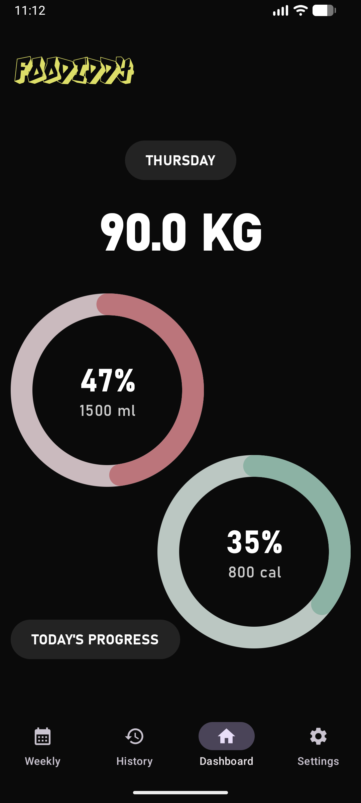
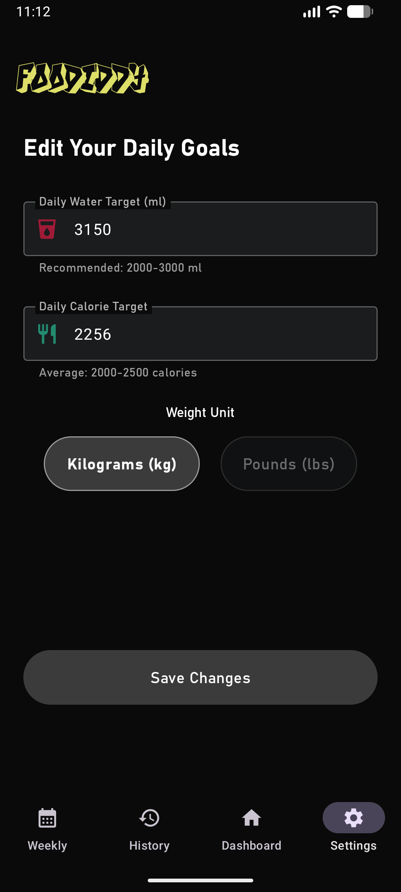
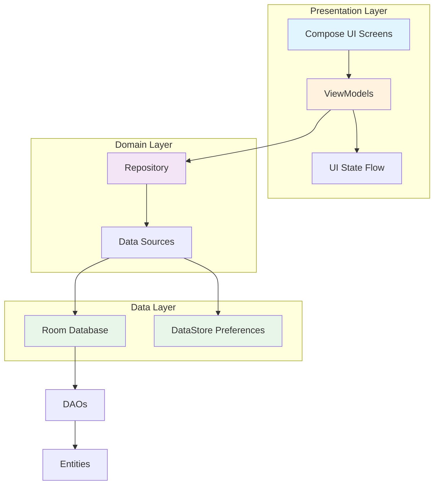

# 🏋️ Foodiddy - Smart Fitness Tracker

<div align="center">


**A modern, intuitive Android fitness tracking app built with Jetpack Compose**

Track your water intake 💧 | Monitor calories 🍎 | Log weight 📊 | Achieve your goals 🎯

[Features](#-features) • [Screenshots](#-screenshots) • [Tech Stack](#-tech-stack) • [Getting Started](#-getting-started) • [Architecture](#-architecture)

</div>

---

## 📱 Screenshots

<div align="center">

### 🎯 Onboarding Experience
<table>
  <tr>
    <td></td>
    <td></td>
  </tr>
  <tr>
    <td align="center"><b>Step 1: Personal Info</b><br/>Name, gender, height & current weight</td>
    <td align="center"><b>Step 2: Smart Goals</b><br/>BMI calculation & personalized recommendations</td>
  </tr>
</table>

### 📊 Main Dashboard
<table>
  <tr>
    <td></td>
  </tr>
  <tr>
    <td align="center"><b>Daily Tracking Hub</b><br/>Monitor water intake, calories, and weight in real-time</td>
  </tr>
</table>

### ⚖️ Average Weekly Weight
<table>
  <tr>
    <td></td>
    <td></td>
  </tr>
  <tr>
    <td align="center"><b>Empty State</b><br/>Friendly prompt when no data exists</td>
    <td align="center"><b>Weekly Trends</b><br/>Track weight averages & week-over-week changes</td>
  </tr>
</table>

### 📅 History & Custom Entries
<table>
  <tr>
    <td></td>
    <td></td>
  </tr>
  <tr>
    <td align="center"><b>Empty State</b><br/>Clean slate with add button</td>
    <td align="center"><b>Historical Data</b><br/>View past entries + Add custom history for any date</td>
  </tr>
</table>

### ⚙️ Settings & Customization
<table>
  <tr>
    <td></td>
  </tr>
  <tr>
    <td align="center"><b>Personalize Your Goals</b><br/>Adjust water & calorie targets, switch weight units</td>
  </tr>
</table>

</div>

---

## ✨ Features

### 🎯 Smart Onboarding
- **Personalized Setup**: Enter name, gender, height, and current weight
- **Automatic BMI Calculation**: Instant BMI calculation with category classification
- **Intelligent Recommendations**: AI-driven daily water and calorie target suggestions based on BMI and gender
- **Customizable Goals**: Edit recommended targets to match your personal preferences

### 💧 Water Tracking
- **Daily Goal Monitoring**: Visual progress tracking with animated progress bars
- **Quick Entry**: Add water with preset buttons (250ml, 500ml, 1L)
- **Custom Amounts**: Enter any custom water amount
- **Timestamped Entries**: Track when you drank water throughout the day
- **Adjustment Support**: Add or subtract water entries as needed

### 🍎 Calorie Tracking
- **Calorie Goal Management**: Set and monitor daily calorie targets
- **Quick Logging**: Fast entry with preset options (200, 500, 1000 cal)
- **Custom Entries**: Log any calorie amount with timestamps
- **Daily Totals**: See consumed vs. target in real-time
- **Flexible Adjustments**: Modify entries to correct mistakes

### ⚖️ Weight Management
- **Weight Logging**: Record weight with date tracking
- **Unit Flexibility**: Support for both kg and lbs
- **Weekly Averages**: Automatic calculation of weekly weight averages
- **Trend Analysis**: Compare week-over-week changes
- **Auto Target Adjustment**: Smart suggestion to update goals when weight changes significantly

### 📊 History & Analytics
- **Daily History**: View all entries for each day with detailed breakdown
- **Custom History Entry**: **Add historical data for any past date** - perfect for tracking missed days
- **Data Management**: Long-press to delete historical entries
- **Weekly Overview**: Automatic weekly weight averages
- **Entry Details**: View individual water and calorie entries with timestamps
- **Empty States**: Friendly prompts guide you when no data exists

### ⚙️ Customization
- **Goal Adjustment**: Edit daily water and calorie targets anytime
- **Unit Preferences**: Switch between kg and lbs
- **Dark Theme**: Beautiful, eye-friendly dark UI
- **Custom Fonts**: Unique typography for better readability

---

## 🛠 Tech Stack

### Core Technologies
- **Language**: [Kotlin](https://kotlinlang.org/) 1.9.20
- **Min SDK**: Android 7.0 (API 24)
- **Target SDK**: Android 14 (API 34)
- **Build Tool**: Gradle 8.1.3 with Kotlin DSL

### Architecture & UI
- **UI Framework**: [Jetpack Compose](https://developer.android.com/jetpack/compose) (Material 3)
- **Architecture Pattern**: MVVM (Model-View-ViewModel)
- **Navigation**: [Jetpack Navigation Compose](https://developer.android.com/jetpack/compose/navigation) 2.7.6
- **Lifecycle**: [Lifecycle Components](https://developer.android.com/topic/libraries/architecture/lifecycle) 2.7.0

### Data Layer
- **Database**: [Room](https://developer.android.com/training/data-storage/room) 2.6.1
  - Type-safe SQL queries
  - Automatic database migrations support
  - Kotlin Coroutines integration
- **Preferences**: [DataStore](https://developer.android.com/topic/libraries/architecture/datastore) 1.0.0
  - User preferences and settings
  - Type-safe preference storage
- **Type Converters**: Custom converters for LocalDate and LocalDateTime

### Asynchronous Programming
- **Coroutines**: [Kotlin Coroutines](https://kotlinlang.org/docs/coroutines-overview.html) 1.7.3
- **Flow**: Reactive data streams for real-time updates
- **StateFlow**: State management in ViewModels

### Dependency Injection
- **Manual DI**: Custom ViewModelFactory with Repository pattern
- **Application-level Singleton**: Database and Repository instances

---

## 🏗 Architecture

Foodiddy follows the **MVVM (Model-View-ViewModel)** architecture pattern with a clean separation of concerns:



### Layer Breakdown

#### 🎨 Presentation Layer
- **Screens**: Jetpack Compose UI components
  - [`OnboardingScreen`](app/src/main/java/com/fitness/tracker/ui/screen/OnboardingScreen.kt) - Two-step personalized setup
  - [`DashboardScreen`](app/src/main/java/com/fitness/tracker/ui/screen/DashboardScreen.kt) - Main tracking interface
  - [`WeeklyWeightScreen`](app/src/main/java/com/fitness/tracker/ui/screen/WeeklyWeightScreen.kt) - Weekly averages
  - [`HistoryScreen`](app/src/main/java/com/fitness/tracker/ui/screen/HistoryScreen.kt) - Historical data view
  - [`SettingsScreen`](app/src/main/java/com/fitness/tracker/ui/screen/SettingsScreen.kt) - Goal customization

- **ViewModels**: State management and business logic
  - Collect data from Repository via Flow
  - Transform data for UI consumption
  - Handle user interactions
  - Manage loading and error states

#### 💼 Domain Layer
- **Repository Pattern**: [`FitnessRepository`](app/src/main/java/com/fitness/tracker/data/repository/FitnessRepository.kt)
  - Single source of truth for data access
  - Abstracts data sources (Room + DataStore)
  - Provides clean API for ViewModels
  - Handles data synchronization

#### 💾 Data Layer
- **Room Database**: [`FitnessDatabase`](app/src/main/java/com/fitness/tracker/data/database/FitnessDatabase.kt)
  - SQLite wrapper with compile-time verification
  - Three entities: WaterEntry, CalorieEntry, WeightEntry
  - Type converters for date/time handling

- **DataStore**: [`UserPreferences`](app/src/main/java/com/fitness/tracker/data/preferences/UserPreferences.kt)
  - User settings and targets
  - First-launch tracking
  - Theme preferences

---

## 💾 Database Schema

### Entities

#### 🚰 WaterEntry
Tracks individual water intake entries throughout the day.

| Column | Type | Description |
|--------|------|-------------|
| `id` | Long | Primary key (auto-generated) |
| `amountMl` | Int | Water amount in milliliters |
| `timestamp` | LocalDateTime | Exact time of entry |
| `date` | String | Date in YYYY-MM-DD format |

#### 🍔 CalorieEntry
Logs calorie consumption with timestamps.

| Column | Type | Description |
|--------|------|-------------|
| `id` | Long | Primary key (auto-generated) |
| `calories` | Int | Calorie amount |
| `timestamp` | LocalDateTime | Time of meal/snack |
| `date` | LocalDate | Entry date |

#### ⚖️ WeightEntry
Records weight measurements over time.

| Column | Type | Description |
|--------|------|-------------|
| `id` | Long | Primary key (auto-generated) |
| `weightKg` | Float | Weight in kilograms |
| `date` | LocalDate | Measurement date |

### Data Access Objects (DAOs)

Each entity has a corresponding DAO interface with common operations:
- Insert, update, delete operations
- Query by date
- Get all entries
- Calculate totals/aggregates
- Flow-based reactive queries

---

## 🚀 Getting Started

### Prerequisites

Before you begin, ensure you have:

- **Android Studio**: [Hedgehog (2023.1.1)](https://developer.android.com/studio) or newer
- **JDK**: Version 17 or higher
- **Android SDK**: 
  - Minimum API 24 (Android 7.0)
  - Target API 34 (Android 14)
- **Gradle**: 8.1.3+ (included via wrapper)

### Installation

1. **Clone the repository**
   ```bash
   git clone https://github.com/yourusername/foodiddy.git
   cd foodiddy
   ```

2. **Open in Android Studio**
   - Launch Android Studio
   - Select `File` → `Open`
   - Navigate to the cloned directory
   - Click `OK`

3. **Sync Gradle**
   - Android Studio will automatically prompt to sync
   - Or manually: `File` → `Sync Project with Gradle Files`
   - Wait for dependencies to download

4. **Build the project**
   ```bash
   ./gradlew build
   ```

### Running the App

#### On an Emulator
1. Create an Android Virtual Device (AVD) in Android Studio
   - `Tools` → `Device Manager` → `Create Device`
   - Select a device (e.g., Pixel 6)
   - Choose Android 14 (API 34) system image
2. Click the `Run` button (▶️) or press `Shift+F10`

#### On a Physical Device
1. Enable Developer Options on your Android device
2. Enable USB Debugging
3. Connect device via USB
4. Click `Run` and select your device

```bash
# Install debug APK via command line
./gradlew installDebug
```

### Project Structure

```
Foodiddy/
├── app/
│   ├── src/main/
│   │   ├── java/com/fitness/tracker/
│   │   │   ├── data/
│   │   │   │   ├── converter/      # Room type converters
│   │   │   │   ├── dao/            # Database access objects
│   │   │   │   ├── database/       # Room database setup
│   │   │   │   ├── entity/         # Data models
│   │   │   │   ├── preferences/    # DataStore implementation
│   │   │   │   └── repository/     # Repository pattern
│   │   │   ├── ui/
│   │   │   │   ├── components/     # Reusable UI components
│   │   │   │   ├── navigation/     # Navigation setup
│   │   │   │   ├── screen/         # App screens (Composables)
│   │   │   │   ├── theme/          # Material 3 theming
│   │   │   │   └── viewmodel/      # ViewModels
│   │   │   ├── FitnessApplication.kt
│   │   │   └── MainActivity.kt
│   │   ├── res/
│   │   │   ├── drawable/           # Images and icons
│   │   │   ├── font/               # Custom fonts
│   │   │   ├── mipmap-*/           # App icons
│   │   │   ├── values/             # Strings, themes, colors
│   │   │   └── xml/                # Backup rules
│   │   └── AndroidManifest.xml
│   └── build.gradle.kts
├── screenshots/                     # App screenshots
├── gradle/                          # Gradle wrapper
├── build.gradle.kts                 # Root build configuration
├── settings.gradle.kts              # Project settings
└── README.md
```

---

## 🎯 Key Features Deep Dive

### Smart BMI-Based Recommendations

When you complete onboarding, Foodiddy calculates your BMI and provides personalized recommendations:

**Water Intake Calculation**:
- BMI < 18.5 (Underweight): 2000 ml
- BMI 18.5-24.9 (Normal): 2500 ml
- BMI 25-29.9 (Overweight): 3000 ml
- BMI ≥ 30 (Obese): 3500 ml

**Calorie Target Calculation**:
Based on BMI and gender for optimal health:
- Adjusts for weight loss, maintenance, or gain
- Considers basal metabolic rate factors
- Provides safe, sustainable targets

### Auto Target Adjustment

When you log a new weight:
1. App recalculates your BMI
2. Compares new targets with current settings
3. If difference is significant (>500ml water or >250 cal):
   - Shows adjustment dialog
   - Explains the reasoning
   - Lets you accept or keep current targets

### Weekly Weight Analysis

The app automatically:
- Groups weight entries by week (Monday-Sunday)
- Calculates average weight for each week
- Compares with previous week
- Displays trend (weight loss/gain) in color-coded format
  - 🟢 Green: Weight loss (positive progress)
  - 🔴 Red: Weight gain

---

## 🤝 Contributing

We welcome contributions! Here's how you can help:

### Ways to Contribute

1. **🐛 Report Bugs**
   - Use GitHub Issues
   - Include steps to reproduce
   - Provide device/OS information
   - Add screenshots if applicable

2. **💡 Suggest Features**
   - Open a Feature Request issue
   - Describe the use case
   - Explain expected behavior

3. **📝 Improve Documentation**
   - Fix typos or unclear instructions
   - Add code comments
   - Update README

4. **💻 Submit Code**
   - Fork the repository
   - Create a feature branch
   - Make your changes
   - Write/update tests
   - Submit a pull request

### Development Guidelines

- Follow Kotlin coding conventions
- Use meaningful variable/function names
- Write descriptive commit messages
- Add comments for complex logic
- Ensure all existing tests pass
- Add tests for new features

### Pull Request Process

1. Update README if needed
2. Test on multiple Android versions
3. Ensure no build warnings
4. Request review from maintainers
5. Address feedback promptly

---

## 📄 License

This project is licensed under the MIT License - see below for details:

```
MIT License

Copyright (c) 2024 Foodiddy

Permission is hereby granted, free of charge, to any person obtaining a copy
of this software and associated documentation files (the "Software"), to deal
in the Software without restriction, including without limitation the rights
to use, copy, modify, merge, publish, distribute, sublicense, and/or sell
copies of the Software, and to permit persons to whom the Software is
furnished to do so, subject to the following conditions:

The above copyright notice and this permission notice shall be included in all
copies or substantial portions of the Software.

THE SOFTWARE IS PROVIDED "AS IS", WITHOUT WARRANTY OF ANY KIND, EXPRESS OR
IMPLIED, INCLUDING BUT NOT LIMITED TO THE WARRANTIES OF MERCHANTABILITY,
FITNESS FOR A PARTICULAR PURPOSE AND NONINFRINGEMENT. IN NO EVENT SHALL THE
AUTHORS OR COPYRIGHT HOLDERS BE LIABLE FOR ANY CLAIM, DAMAGES OR OTHER
LIABILITY, WHETHER IN AN ACTION OF CONTRACT, TORT OR OTHERWISE, ARISING FROM,
OUT OF OR IN CONNECTION WITH THE SOFTWARE OR THE USE OR OTHER DEALINGS IN THE
SOFTWARE.
```

---

## 🙏 Acknowledgments

- **Jetpack Compose Team** - For the amazing UI toolkit
- **Material Design** - For design guidelines and components
- **Android Community** - For continuous support and resources

---

## 📞 Contact & Support

- **Issues**: [GitHub Issues](https://github.com/yourusername/foodiddy/issues)
- **Discussions**: [GitHub Discussions](https://github.com/yourusername/foodiddy/discussions)

---

<div align="center">

**Made with ❤️ by the Foodiddy Team**

⭐ Star this repo if you find it helpful!

[Back to Top](#-foodiddy---smart-fitness-tracker)

</div>